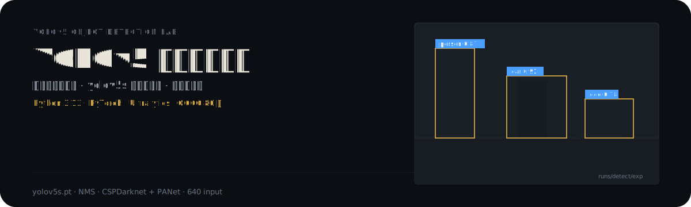

<p align="center">
  
</p>

# YOLOv5 目标检测实训

基于 YOLOv5 目标检测框架，对不同场景下的图片进行目标检测实践。包含多组测试图片和对应的检测结果可视化，涵盖街道、室内、自然场景等多种环境。

## 实训内容

1. **环境搭建**：安装 YOLOv5 依赖，下载预训练权重 `yolov5s.pt`，配置 Python 环境
2. **目标检测实践**：使用 YOLOv5 预训练模型对不同场景图片检测
   - 街道场景：行人、车辆、交通标志
   - 室内场景：家具、电器、人物
   - 自然场景：动物、植物
3. **检测结果分析**：分析不同场景检测准确率、对比置信度、评估模型表现

## 技术栈

- YOLOv5（Ultralytics）
- PyTorch
- Python 3.13
- CUDA（GPU 加速，可选）
- 预训练权重：`yolov5s.pt`

## 项目结构

```
├── test_images/              # 测试输入图片
│   ├── street_scene1.jpg    # 街道场景
│   ├── street_scene2.jpg
│   ├── new_scene1.jpg        # 新场景
│   ├── new_scene2.jpg
│   ├── scene3.jpg · scene4.jpg
│   └── new_image1.jpg · new_image2.jpg
├── results/                  # 检测结果图片
│   ├── result_bus.jpg        # 公交车检测
│   ├── result_zidane.jpg     # 人物检测
│   ├── result_bedroom.jpg    # 卧室场景
│   ├── result_forest.jpg     # 森林场景
│   ├── result_restaurant.jpg # 餐厅场景
│   └── result_new11.jpg · result_new22.jpg
└── README.md
```

## 使用方法

### 安装依赖

```bash
git clone https://github.com/ultralytics/yolov5.git
cd yolov5
pip install -r requirements.txt
```

### 运行检测

```bash
python detect.py --weights yolov5s.pt --source path/to/image.jpg
```

检测结果默认保存在 `runs/detect/exp/` 目录。

### 查看结果

输入图片放在 `test_images/`，对应检测结果放在 `results/`。对比两组图片可评估 YOLOv5 检测效果。

## 注意事项

1. 本项目仅包含测试图片和检测结果，YOLOv5 源码请从 [ultralytics/yolov5](https://github.com/ultralytics/yolov5) 获取
2. 检测结果使用 `yolov5s` 预训练权重生成
3. 图片仅供学习参考

---

<p align="center"><sub>作者 liem · YOLOv5 目标检测实训</sub></p>
