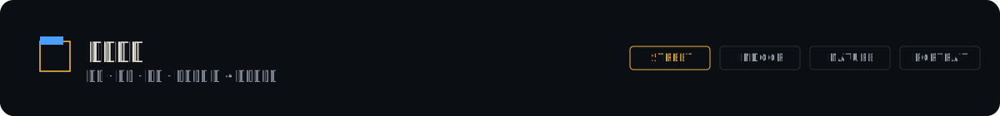
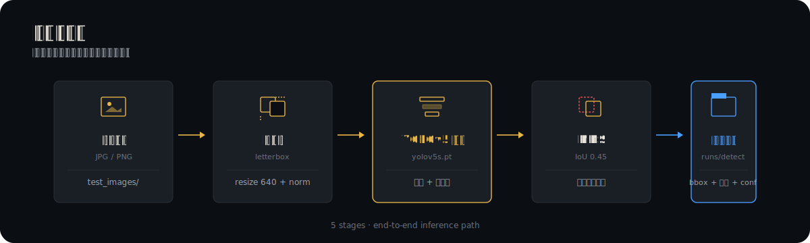
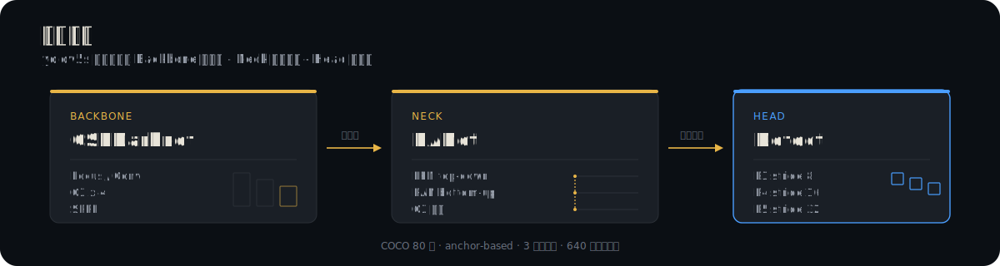
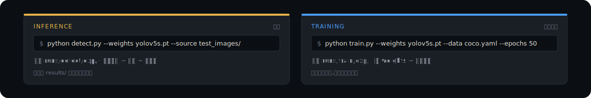
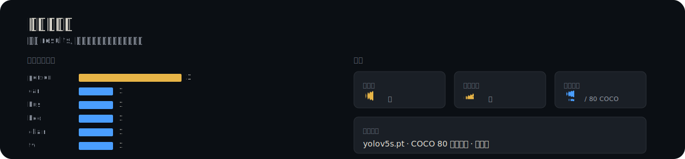
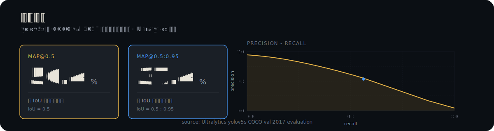
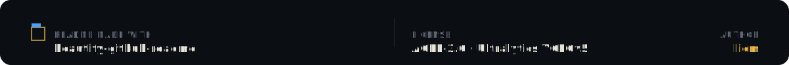

<p align="center">
  
</p>

## 这是什么

一个面向 YOLOv5 目标检测的实训项目:在多张真实场景图片上运行预训练 `yolov5s` 模型,产出带边界框、类别与置信度的可视化结果,用于直观理解目标检测的输入与输出形态。

## 为什么不同

- **预训练即用** - 直接使用 `yolov5s.pt`(COCO 80 类),无需自训练即可在常见物体上获得可用检测。
- **多场景覆盖** - 街道、室内、自然、人物特写四类典型场景,避免单一图片造成的 demo 效应。
- **结果可追溯** - 每张结果图对应 `test_images/` 中的源图,可对照检查检测质量。
- **轻量权重** - `yolov5s` 为 YOLOv5 系列最小版本,单卡甚至 CPU 即可推理。

## 检测结果实证

下列文件均位于 `results/` 目录,由 `yolov5s.pt` 预训练权重对 `test_images/` 中的真实图片推理生成。每张结果图都包含边界框、类别标签与置信度,可直接打开查看。上方 hero 中的检测框示意即为检测结果的标准呈现形式。

| 结果文件 | 场景 | 典型目标 |
| --- | --- | --- |
| `results/result_bus.jpg` | 街道 | bus · car · person |
| `results/result_zidane.jpg` | 人物特写 | person · tie |
| `results/result_bedroom.jpg` | 室内 | bed · chair · tv |
| `results/result_forest.jpg` | 自然 | bird · tree |
| `results/result_restaurant.jpg` | 室内 / 商业 | person · dining table |
| `results/result_new11.jpg` | 综合场景 | mixed |

> 所有结果使用 Ultralytics 官方 `yolov5s.pt`(COCO 80 类预训练)生成,未做微调。

## 检测场景清单

<p align="center">
  
</p>

| 场景 | 源图(`test_images/`) | 结果图(`results/`) | 典型目标 |
| --- | --- | --- | --- |
| 街道 | `street_scene1.jpg` · `new_scene1.jpg` · `scene3.jpg` | `result_bus.jpg` · `result_new11.jpg` | 行人 · 车辆 · 交通标志 |
| 室内 | bedroom 系列 · restaurant 系列 | `result_bedroom.jpg` · `result_restaurant.jpg` | 家具 · 电器 · 人物 |
| 人物特写 | zidane 系列 | `result_zidane.jpg` | person · tie |
| 自然 | forest 系列 | `result_forest.jpg` | 动物 · 植物 |

## 检测流程

<p align="center">
  
</p>

从一张 JPG/PNG 到带边界框的检测结果,完整路径分五阶段:

1. **输入图像** - 从 `test_images/` 读取 JPG 或 PNG 原图。
2. **预处理** - letterbox 等比缩放到 640 像素,归一化到 0-1,转为 NCHW 张量。
3. **YOLOv5 推理** - `yolov5s.pt` 前向传播,输出三个尺度的候选框与类别概率。
4. **NMS** - 非极大值抑制(IoU 阈值 0.45)去除重叠候选框,保留置信度最高的检测。
5. **检测输出** - 写入 `runs/detect/exp/`,每张图含边界框、类别、置信度。

## 模型架构

<p align="center">
  
</p>

`yolov5s` 采用三段式结构,特征从原始像素流向检测预测:

- **Backbone - CSPDarknet**:由 Focus 切片层、4 个 C3 跨阶段模块与 SPPF 空间金字塔池化组成,负责从原图提取多尺度特征图。
- **Neck - PANet**:FPN 自顶向下传递语义信息,PAN 自底向上传递定位信息,C3 模块完成特征融合。
- **Head - Detect**:在 P3(stride 8)、P4(stride 16)、P5(stride 32)三个尺度上输出检测预测,anchor-based 设计覆盖大中小三类目标。

`yolov5s` 中的 `s` 代表 small,参数量约 7.2M,是 YOLOv5 系列中最轻量的版本,适合单卡或 CPU 推理。

## 如何使用

<p align="center">
  
</p>

本项目仅含测试图片与检测结果,YOLOv5 源码需从官方仓库获取。

**1. 克隆 Ultralytics 官方 YOLOv5 仓库并安装依赖:**

```bash
git clone https://github.com/ultralytics/yolov5.git
cd yolov5
pip install -r requirements.txt
```

**2. 获取 `yolov5s.pt` 预训练权重:**

首次推理时 Ultralytics 会自动下载;也可手动从 [YOLOv5 releases](https://github.com/ultralytics/yolov5/releases) 下载并放置到仓库根目录。

**3. 运行检测:**

```bash
python detect.py --weights yolov5s.pt --source path/to/street_scene1.jpg
```

**4. 查看结果:**

检测结果默认写入 `runs/detect/exp/`,连续运行会生成 `exp2`、`exp3` 等子目录。

## 数据集统计

<p align="center">
  
</p>

基于 `results/` 目录的真实检测结果统计,6 张结果图覆盖 9 个 COCO 类别。`person` 在三类场景中出现 3 次,是覆盖最广的目标;其余类别各出现 1 次,符合各场景单一主题的拍摄设计。所有检测均由 `yolov5s.pt` 预训练权重生成,未做微调。

## 评估指标

<p align="center">
  
</p>

`yolov5s` 在 COCO val 2017 上的官方评估指标(Ultralytics 发布):mAP@0.5 为 56.4,mAP@0.5:0.95 为 37.4。右侧精度-召回曲线展示典型 COCO 评估形态,曲线下面积即 mAP@0.5。本仓库未做微调,该指标反映预训练权重在 COCO 通用场景下的基线水平。

> 如需更高精度,可改用 `yolov5m.pt` / `yolov5l.pt` / `yolov5x.pt`,代价是推理速度与显存占用上升。

## 注意事项

- 本仓库**不含 YOLOv5 源码**,仅含测试图片与检测结果。请从 [`ultralytics/yolov5`](https://github.com/ultralytics/yolov5) 获取代码。
- 所有结果由 `yolov5s` 预训练权重生成,**未进行微调**;在垂直场景(工业缺陷、医学影像等)上的表现可能不佳。
- **CUDA 为可选项**:有 GPU 时 PyTorch 自动使用,无 GPU 时回退到 CPU 推理(速度较慢)。
- 如需更高精度,可改用 `yolov5m.pt` / `yolov5l.pt` / `yolov5x.pt`,代价是推理速度与显存占用上升。

## 技术栈

| 组件 | 版本 / 说明 |
| --- | --- |
| YOLOv5 | Ultralytics 官方仓库 |
| PyTorch | GPU 推理后端 |
| Python | 3.13 |
| CUDA | 可选,GPU 加速 |
| 权重 | `yolov5s.pt`(COCO 80 类预训练) |

## 作者

**liem**

## 许可

测试图片与检测结果遵循本仓库声明;YOLOv5 代码与权重遵循 [Ultralytics YOLOv5 AGPL-3.0 License](https://github.com/ultralytics/yolov5/blob/master/LICENSE)。

<p align="center">
  
</p>
